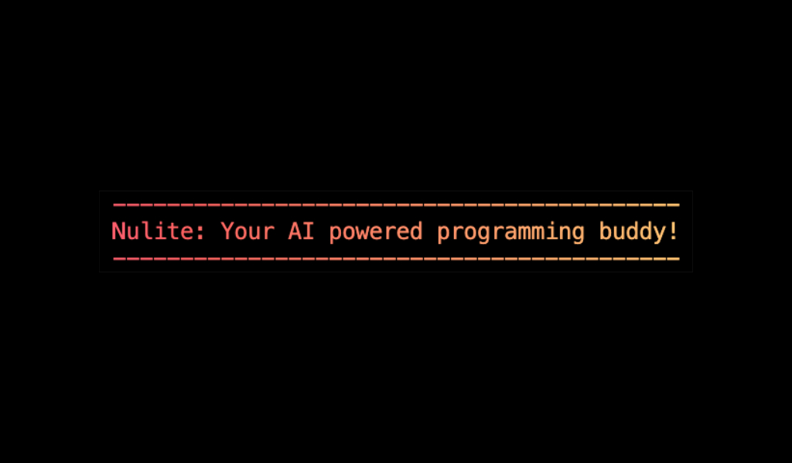

<h1 align="center">
	
</h1>

<br />

<p align="center">
  <a href="https://opensource.org/licenses/MIT">
    
  </a>
</p>

<br />

## Install

```sh
npm install --global nulite
```

## 🙌 Thanks to all our contributors

<a href="https://github.com/JohnFromme/nulite/graphs/contributors">
  
</a>